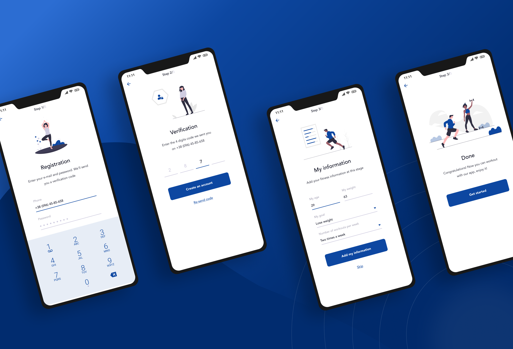
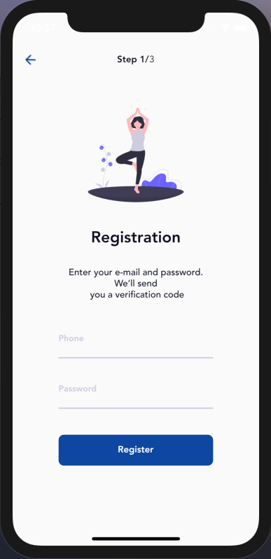
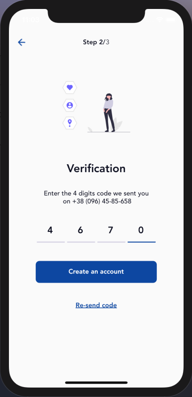
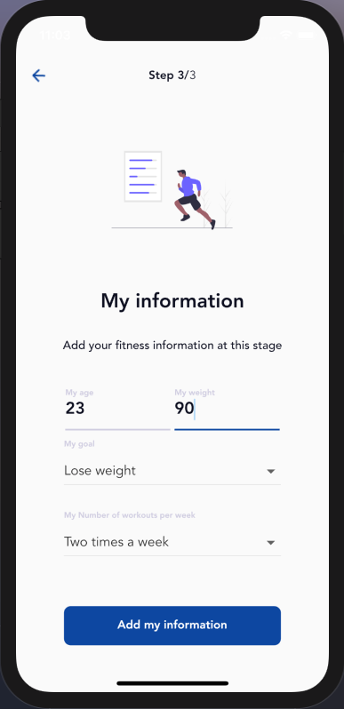
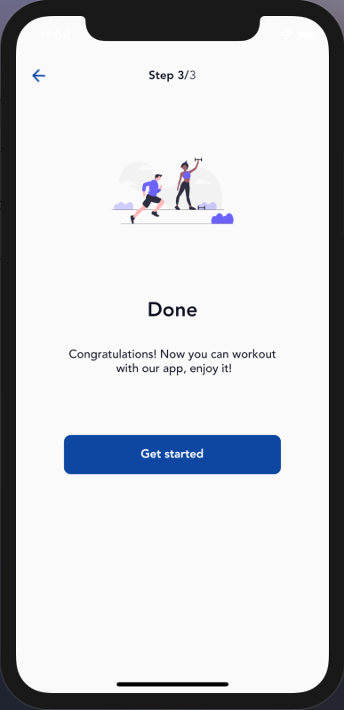

# day_health

Workout routine application to stay healthy.

This project is a UI integration with Flutter.

## Getting Started

- Clone the repo.
- Install dependencies
- And run the app

## Design credit:

Amazing design work!
[Atilog - Free Mobile APP UI kit](https://www.behance.net/gallery/93705559/Atilog-Free-Mobile-APP-UI-kit).

From this

To this

   
